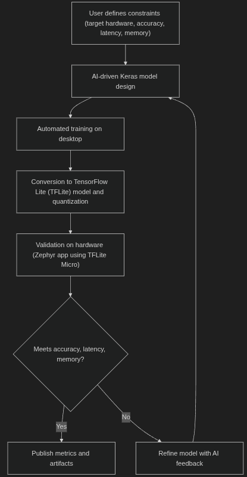
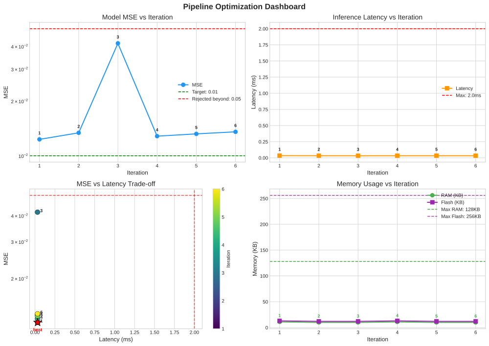
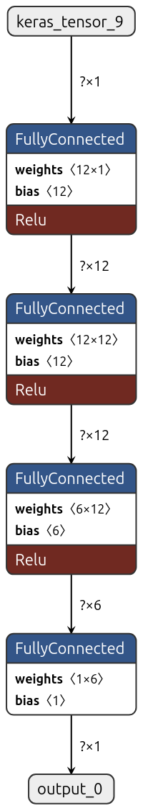

<!--
  Copyright (C) 2025 Rufilla Ltd
-->

# ZephyrMLForge

An automated model iteration pipeline for embedded systems running Zephyr RTOS. An AI
agent proposes a network, the pipeline trains & quantises it, builds & runs it on a
Cortex-M target, & feeds the measured result back into the next proposal.



See [`docs/program_flow.md`](docs/program_flow.md) for the full flow.

## What it does

1. **Proposes** an architecture with an AI agent (the Claude or ChatGPT APIs, a local
   Claude Code installation, or an offline pseudo agent)
2. **Trains** it with early stopping, on synthetic data or on MNIST / Fashion-MNIST
3. **Quantises** it to int8 TFLite
4. **Builds & runs** the real TFLite Micro firmware, under QEMU or on hardware
5. **Measures** inference latency on the target, & the error of the quantised model
   with the error bar its validation set admits
6. **Feeds back** every measurement, including failures, into the next proposal

## What it does not do

- It does not sandbox the agent. Generated Python is executed in the pipeline's own
  process; run it only with a provider & key you trust.
- It does not yet execute on the NPU. The accelerator path is built & boards declare
  their accelerator in `pyproject.toml`, but on the FRDM-MCXN947, the only NPU board
  tried, neither converter version tested (3.0.0, 3.2.2) produces a model that runs
  against NXP's current driver blobs & TFLM integration — see
  [Neural accelerators](#neural-accelerators).
- It does not fetch arbitrary datasets. `dataset.source` takes `synthetic`, `mnist` or
  `fashion_mnist`; anything else means writing a loader.
- It does not hold out a third split. The set that stops training early is the set the
  reported score is measured on, which flatters that score by a fraction of a point.

## Install

```bash
git clone <this repository> && cd zephyrmlforge
./setup.sh
source activate.sh
```

Where:

- `setup.sh` creates `.venv`, installs the package & Zephyr's own Python requirements,
  fetches the TFLite Micro module into your west workspace & runs the test suite
- `activate.sh` activates the environment & exports `ZEPHYR_BASE`, the SDK path & the
  SDK's bundled QEMU

Prerequisites, checked by `setup.sh`:

- Python 3.10+, cmake, & ninja or make
- An initialised west workspace. It is found at `~/zephyrproject` or
  `/opt/zephyrproject`; set `MLFORGE_WEST_WORKSPACE` if yours is elsewhere.
- A Zephyr SDK under `~`, `~/.local` or `/opt`
- graphviz, for the model architecture diagram only (`sudo apt install graphviz`)

## Quick start

No hardware & no toolchain, to see the loop run. `--simulate` still asks the configured
provider for a proposal, so set `ai_agent.provider: pseudo` first, or export a key for
the provider the file names:

```bash
zephyr-ml-forge run --simulate
# → Iteration successful: mse=0.011677 ± 0.001219 on 200 samples, latency=0.007ms
# → Best Result: Iteration 1
```

Under QEMU, or on a connected board:

```bash
zephyr-ml-forge run                      # follows execution_environment.mode
zephyr-ml-forge run --hil                # forces hardware, overriding the file
zephyr-ml-forge validate -c config/pipeline_config.yaml
zephyr-ml-forge graph -a artifacts/      # regenerate graphs from a finished run
```

An API key is needed only for the two API providers:

| Variable | Used for |
|---|---|
| `ANTHROPIC_API_KEY` | `provider: claude` |
| `OPENAI_API_KEY` | `provider: chatgpt` |
| `MLFORGE_WEST_WORKSPACE` | west workspace, when it is not in a standard place |

Put them in `.env`; `activate.sh` loads it. `provider: claude_code` & `provider: pseudo`
need no key.

## AI providers

| Provider | Backed by | Needs |
|---|---|---|
| `claude` | Anthropic Messages API | `ANTHROPIC_API_KEY` |
| `chatgpt` | OpenAI chat completions | `OPENAI_API_KEY` |
| `claude_code` | A local Claude Code installation, driven headless | `claude` on `PATH` |
| `pseudo` | A fixed sequence of narrowing MLPs | nothing; for testing the loop |

`claude_code` runs `claude --print` per proposal, replacing Claude Code's own system
prompt with the pipeline's & denying it every tool — it only has to return JSON. Each
call runs in an empty scratch directory, so a `CLAUDE.md` cannot reach a proposal.

The cost to know about: each call carries the Claude Code harness, about 14k tokens
before the pipeline's own prompt, against roughly 2k for the same request through the
API. The prompt is stable across iterations, so only the first call of a run pays in
full & the rest are served from the prompt cache. Measured on one proposal here: \$0.09
& about seven seconds. Fine for eight iterations; not for a long search. Whether your
plan permits programmatic use is a licensing question worth checking.

## Configuration

`config/pipeline_config.yaml` is the contract: everything the pipeline honours is
declared there, & a run is reproducible from its `config_snapshot.yaml`. The fields
worth knowing first:

```yaml
hardware:
  board: frdm_mcxn947/mcxn947/cpu0
  tensor_arena_kb: 8        # compiled into the firmware; too small fails at startup
  qemu_board: qemu_cortex_m3

execution_environment:
  mode: hil                 # qemu | hil | auto
  serial_port: /dev/ttyACM0
  flash_runner: null        # pyocd | linkserver | jlink; null uses the board default
  benchmark_runs: 100       # inferences averaged for the reported latency

accuracy:
  metric: mse               # mse | mae (lower is better) | accuracy (higher is better)
  target: 0.01              # optimised toward
  max_error: 0.05           # rejected beyond
  evaluate_on_device: false # true scores predictions the board itself produced

dataset:
  source: synthetic         # synthetic | mnist | fashion_mnist
  train_samples: 6000       # image sets only; synthetic sizing is under synthetic_data
  val_samples: 10000        # the error bar on the reported score narrows as this rises

performance:
  max_latency_ms: 5         # hard limits; an iteration outside any of them is rejected
  max_ram_kb: 128
  max_flash_kb: 256
```

Two templates ship: `config/pipeline_config.yaml`, synthetic regression scored by MSE &
built from dense layers, & `config/fashion_mnist_config.yaml`, Fashion-MNIST
classification scored by accuracy, built from convolutions & given a 64 KB tensor arena
to hold their activations.

For `metric: accuracy` the two bounds invert: `target` is the accuracy to reach &
`max_error` is the lowest still accepted. That pairing is checked at load time, as is a
tensor arena larger than the RAM budget.

**Letting the agent stop.** With `iteration.allow_agent_stop: true` (the default) the
agent may end the run instead of proposing, by returning
`{"stop": true, "stop_reason": "..."}`. It is told the irreducible floor in every request,
so it can distinguish a solved task from a stalled search, & nothing is trained, built
or flashed for that iteration. Set the option false to make it always use the full
budget.

**Mind the noise floor.** Under `dataset.source: synthetic`, labels are the chosen
function plus `noise_stddev` of Gaussian noise, so a model that recovers the function
exactly is still scored against that noise: mean squared error bottoms out at
`noise_stddev²`, mean absolute error at `noise_stddev × √(2/π)`. A target at or below the
floor cannot be met by any model, & the run will always spend its whole iteration budget;
the pipeline says so at start-up. With the shipped `noise_stddev: 0.1`, no model beats an
MSE of 0.01.

The task given to the agent is prose, in `[tool.zephyr-ml-forge.task]` in
`pyproject.toml`. Change it to change what the pipeline is asked to build.

## Execution modes

| Mode | Builds | Runs on | Latency from | Accuracy from |
|---|---|---|---|---|
| `--simulate` | nothing | host interpreter | host, not comparable | host interpreter |
| `qemu` | `qemu_cortex_m3` | emulator | emulated cycle counter | host interpreter |
| `hil` | the real board | hardware | on-target cycle counter | host, or the board |
| `auto` | both | QEMU, then hardware | as above | as above |

Latency is measured on the target with each `Invoke()` timed alone & averaged over
`benchmark_runs` inferences. The input write & every line of console output are outside
the timed region: a 784-input model spends roughly 100 us quantising its input, which
would otherwise be counted as inference.

Accuracy is measured on the host interpreter by default, on the same quantised model
the device runs. Set `accuracy.evaluate_on_device: true` to score predictions the
hardware itself produced: the host sends `INFER` commands over the serial console &
compares the replies. That is slower — one round trip per sample, capped by
`on_device_samples` — & is the honest number when host & device disagree.

**Mind the error bar.** Every metric is a mean over the validation set, so it is printed
with that set's own sampling error: `0.872000 ± 0.004287`. For `accuracy` the error is
about `√(p(1−p)/n)` — one point at `val_samples: 1000`, a third of that at the 10,000 the
Fashion-MNIST template uses. A run reports the best of several iterations, so noise alone
lifts that figure: the model that drew the kindest samples wins. Where the best
iteration's lead over the runner-up is narrower than one standard error, the summary says
so & the agent is told in its next request, because there is nothing there to optimise
toward. On-device scoring uses `on_device_samples` instead, which is far fewer &
correspondingly wider.

Observed on a FRDM-MCXN947 with the pseudo agent, one iteration, scoring 64 validation
samples on the board: MSE 0.007153 ± 0.001218, 28 us an inference over 100 runs, 1060
bytes of tensor arena, 68 KB RAM & 175 KB flash. Host & device predictions agreed to
within 5e-7 on every input tried, so the host figure is a fair stand-in for the device
one on this model.

## Output

Each iteration writes `artifacts/iteration_XXXX/`:

| File | Contents |
|---|---|
| `model_code.py` | The agent's Keras code, as executed |
| `model_architecture.png` | Layer diagram (needs graphviz) |
| `weights.keras` | Trained model |
| `model.tflite` | Quantised int8 model |
| `weights_metadata.json` | Layer names & shapes offered to the next iteration |
| `result.json` | Status, metrics with their error bars & failure reason |
| `config_snapshot.yaml` | The configuration used, with no credential in it |
| `model_files/model.cpp`, `model.hpp` | The model compiled to a C array |
| `zephyr_build/` | `build.log`, `zephyr.elf`, `zephyr.bin`, `zephyr.map`, `app_src/` |

A previous `artifacts/` directory is zipped beside itself before a new run starts.

Graphs land in `artifacts/graphs/`: error against iteration drawn with its error bars,
latency against iteration, the trade-off between them, memory against iteration, & a
combined dashboard, each drawn with the configured limits marked.



Inspect a quantised model interactively with `netron artifacts/iteration_0001/model.tflite`,
or `zephyr-ml-forge visualize artifacts/iteration_0001/model.tflite -m summary`.



## Neural accelerators

Some boards carry an NPU. That is a fact about the hardware, so it is declared once in
`pyproject.toml` rather than in every run configuration:

```toml
[tool.zephyr-ml-forge.boards.frdm_mcxn947]
accelerator = "neutron"
neutron_target = "mcxn94x"     # neutron_compiler --show-targets lists them
```

A run asks for it with `execution.npu: true`. Asking on a board with none is refused at
start-up, naming the boards that have one; an unlisted board is assumed to have none, so
it runs on its CPU rather than failing.

On the FRDM-MCXN947 the path is built but not usable: models compile & the firmware
reports `accelerator=neutron`, but neither converter version tested (3.0.0, 3.2.2)
produces a model that runs against NXP's current driver blobs & TFLM integration. The
other declared boards are untested. [Neural accelerators](docs/accelerators.md) carries
the install, both failure modes & what was excluded by test.

## Firmware

The firmware has one source, [`zephyr_app/`](zephyr_app/README.md), which the pipeline
copies per run & overwrites `model.cpp`, `model.hpp` & `app_config.h` in. A build
failure in the pipeline therefore reproduces with a plain `west build zephyr_app`.

The agent may only propose operations the firmware's resolver registers — Dense, Conv2D,
DepthwiseConv2D, MaxPooling2D, AveragePooling2D, GlobalAveragePooling2D, Flatten,
Reshape, ZeroPadding2D & Add, with the relu/relu6/sigmoid/softmax activations. Widening
that list means widening both `zephyr_app/src/main_functions.cpp` &
`pipeline/agents/base.py`; widening only the prompt produces a model that builds, flashes
& then hard-faults.

Convolution runs through the CMSIS-NN kernels, enabled by
`CONFIG_TENSORFLOW_LITE_MICRO_CMSIS_NN_KERNELS`. Measured on the FRDM-MCXN947 with one
Fashion-MNIST convolutional model: 461.9 ms an inference through the reference kernels,
25.6 ms through CMSIS-NN. A model that breaches its latency budget on one is comfortable
on the other, so the setting is not optional in practice.

## Terminal output

Most of what a run prints comes from TensorFlow, not from this package. Verbosity is set
in `pyproject.toml`, because it changes nothing about the run — a quiet run & a loud one
produce identical artefacts:

```toml
[tool.zephyr-ml-forge.output]
verbosity = "normal"   # quiet | normal | verbose | debug
```

| Level | Shows |
|---|---|
| `quiet` | Warnings, errors & the results table |
| `normal` | Progress through each iteration (default) |
| `verbose` | Adds debug logging: full prompts, serial traffic, captured tool output |
| `debug` | Adds TensorFlow's own output: SavedModel dumps, absl logs, warnings |

`-q` & `-v` override it for one run, on either side of the subcommand:

```bash
zephyr-ml-forge -q run          # or: zephyr-ml-forge run -q
```

At `normal` the native output TensorFlow writes straight to the terminal is captured
rather than discarded — it is logged at debug level, & at warning level if the step that
produced it failed, so a failed conversion still says why.

## Tests

```bash
pytest -q
# → 188 passed in 9.8s
```

The suite covers the configuration schema, prediction scoring & its error bars, build &
console output parsing, constraint checking, the board registry, the agent retry loop,
firmware generation & the serial protocol against a pseudo-terminal. It needs neither
TensorFlow nor a board.

## Supported hardware

Developed against the NXP FRDM-MCXN947 (Cortex-M33, 512 KB RAM, 2 MB flash) with its
MCU-LINK CMSIS-DAP probe. Any Zephyr board carrying the TFLite Micro module should work:
set `hardware.board`, & `execution_environment.flash_runner` if the board's default
runner is not installed. Installing NXP LinkServer, why pyocd failed on this board & what
the serial link expects are in [Flashing the FRDM-MCXN947](docs/flashing.md).

## Documentation

[Program flow](docs/program_flow.md) · [Neural accelerators](docs/accelerators.md) ·
[Flashing the FRDM-MCXN947](docs/flashing.md) · [Firmware source](zephyr_app/README.md)

## Licence

Copyright (C) 2025 Rufilla Ltd

Licensed under the [Apache License, Version 2.0](LICENSE).
