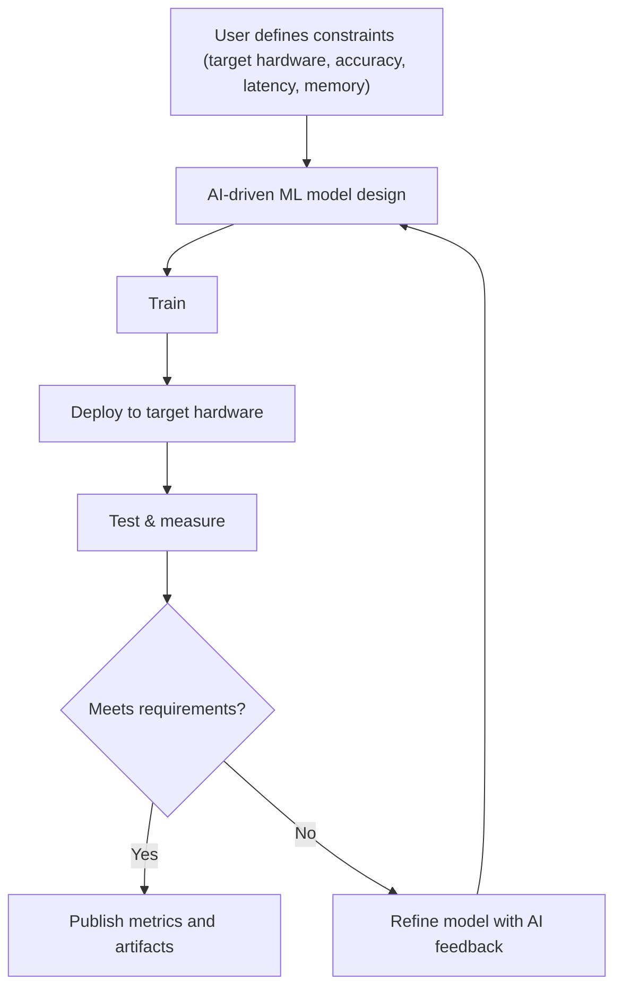

```mermaid
flowchart TD
  A["User defines constraints (target hardware, accuracy, latency, memory)"] --> B["AI-driven ML model design"]
  B --> C["Train"]
  C --> D["Deploy to target hardware"]
  D --> E["Test & measure"]
  E --> F{"Meets requirements?"}
  F -- Yes --> G["Publish metrics and artifacts"]
  F -- No --> H["Refine model with AI feedback"]
  H --> B
```
