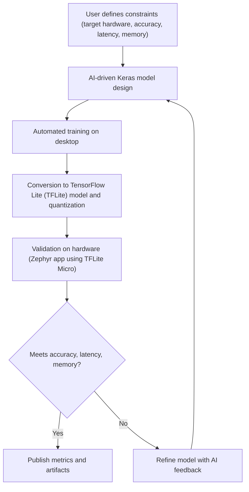

# Program Flow

This document captures the simplified ZephyrMLForge iteration flow.

```mermaid
flowchart TD
  A["User defines constraints (target hardware, accuracy, latency, memory)"] --> B["AI-driven Keras model design"]
  B --> C["Automated training on desktop"]
  C --> D["Conversion to TensorFlow Lite (TFLite) model and quantization"]
  D --> E["Validation on hardware (Zephyr app using TFLite Micro)"]
  E --> F{"Meets accuracy, latency, memory?"}
  F -- Yes --> G["Publish metrics and artifacts"]
  F -- No --> H["Refine model with AI feedback"]
  H --> B
```
