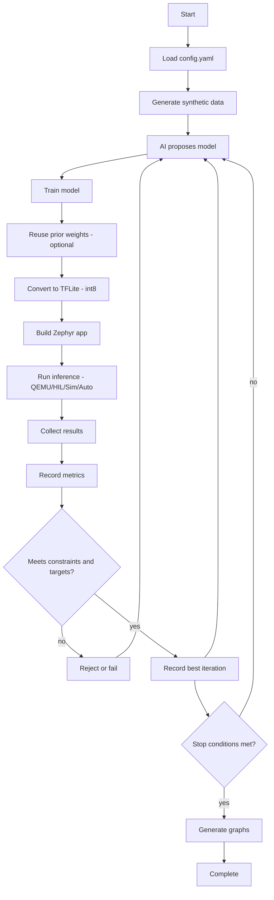

# Program Flow

This document captures the full ZephyrMLForge iteration flow.

Notes:
- Synthetic data is generated once per run, then reused across iterations.
- Constraints include accuracy, latency, RAM, and flash limits.
- The pipeline stops when targets are met or max iterations are reached.
